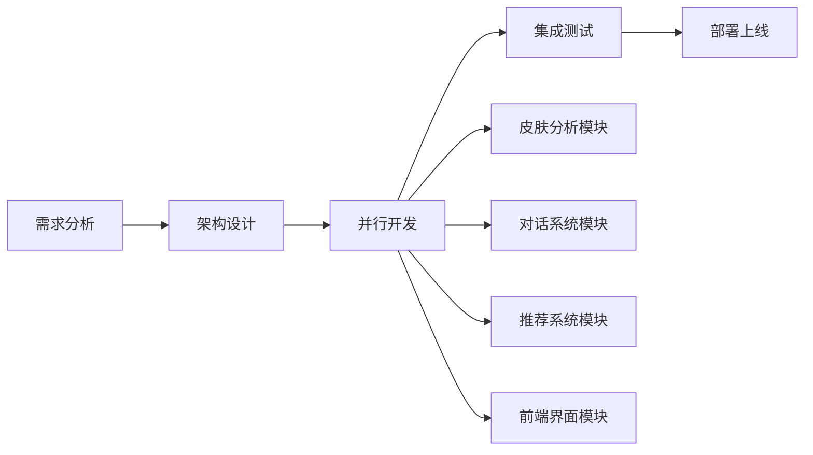

# SkinTech 智能皮肤分析平台 - 项目概述

## 🌟 项目愿景

> **团队理念**: 让用户成为自己喜欢的人

## 📋 项目背景

随着人们生活水平的提高，对皮肤健康和美容的关注度日益增加。然而，专业的皮肤分析通常需要到医疗机构或美容院进行，成本较高且不够便捷。同时，市场上现有的皮肤分析应用大多功能单一，分析结果不够准确，无法满足用户的需求。

**市场痛点**:
- 📍 **地理限制**: 需要前往专业机构，不够便捷
- 💰 **成本高昂**: 专业分析费用昂贵，普通用户难以承受
- 🎯 **功能单一**: 现有应用分析维度有限，结果不够全面
- ⚡ **体验割裂**: 分析与解决方案脱节，缺乏个性化建议

**我们的解决方案**: 开发一款基于多个大模型和MCP人工智能技术的智能皮肤分析平台，通过分析用户上传的皮肤照片，提供专业的皮肤状况评估和个性化护理建议，帮助用户更好地了解和管理皮肤健康，并智能推荐护肤商品。

---

## 🏗️ 技术架构总览

### 核心技术栈

```
┌─────────────────────────────────────────────────────────────┐
│                    SkinTech 技术架构                         │
├─────────────────────────────────────────────────────────────┤
│  皮肤分析引擎    →    智能推理引擎    →    产品推荐系统     │
│  阿里云API      →    DeepSeek-R1    →    电商MCP工具      │
│  图像量化       →    多轮对话RAG     →    个性化推荐       │
└─────────────────────────────────────────────────────────────┘
```

### 创新亮点

1. **🎯 多模型协同**: 阿里云+DeepSeek+NVIDIA多AI引擎协同
2. **🔄 MCP协议**: 模型间上下文无缝传递和协调  
3. **📊 量化分析**: 6维皮肤指标精准量化评估
4. **🤖 智能对话**: RAG增强的多轮对话优化
5. **🛒 电商集成**: AI驱动的个性化产品推荐

---

## 🔬 第一环节: 皮肤分析系统

### 1.1 图像智能量化分析

**核心功能**: 将用户皮肤图像转化为指标数据量化结果

**技术实现**:
```python
# 阿里云皮肤病理检测API
def analyze_skin_image(image_url):
    client = ImageprocessClient(config)
    request = DetectSkinDiseaseRequest()
    request.url = image_url
    
    response = client.detect_skin_disease(request)
    return {
        'acne': response.data.acne_status,
        'wrinkles': response.data.wrinkles_status, 
        'pigmentation': response.data.pigmentation_status,
        'pores': response.data.pores_status,
        'oily': response.data.oily_status,
        'sensitivity': response.data.sensitivity_status
    }
```

**分析维度**:
- 🔴 **痘痘指数**: 痤疮分布和严重程度  
- 📏 **皱纹指数**: 细纹和深层皱纹评估
- 🎨 **色素指数**: 色斑、暗沉等色素沉着
- 🕳️ **毛孔指数**: 毛孔粗大程度分析
- 💧 **油脂指数**: 皮肤出油状况评估  
- ⚠️ **敏感指数**: 皮肤敏感性和泛红程度

**质量保障**:
- ✅ **图像预处理**: 自动检测和过滤低质量图片
- ✅ **多角度分析**: 支持用户上传多角度皮肤图片
- ✅ **隐私保护**: 本地缓存处理，分析后自动删除

### 1.2 RAG增强的多轮对话系统

**技术架构**: 基于DeepSeek-R1的知识检索增强生成

```python
class SkinAnalysisRAG:
    def __init__(self):
        self.deepseek_client = OpenAI(
            api_key=config['deepseek_api']['api_key'],
            base_url=config['deepseek_api']['base_url']
        )
        
    def multi_turn_dialogue(self, analysis_result, user_question):
        # 构建RAG上下文
        context = self.retrieve_skin_knowledge(analysis_result)
        
        # 多轮对话处理
        prompt = ChatPromptTemplate.from_template("""
        基于皮肤分析结果: {analysis}
        相关专业知识: {context}  
        用户问题: {question}
        
        请提供专业的皮肤健康建议...
        """)
        
        return self.deepseek_client.chat.completions.create(
            model="deepseek-reasoner",
            messages=[{"role": "user", "content": prompt.format(...)}],
            stream=True
        )
```

**核心特性**:
- 🧠 **置信度阈值**: 低于0.7的指标自动触发多轮确认对话
- 📚 **知识库检索**: 专业皮肤医学知识库RAG增强
- 🔄 **语义理解**: 逐步完善病变特征描述
- 🎯 **个性化回复**: 基于用户肌肤状况的定制化建议

### 1.3 联网搜索与信息过滤

**架构设计**: Perplexity API + FastMCP封装

```python
@mcp_tool
def perplexity_search(query: str, skin_analysis: dict) -> str:
    """
    联网搜索皮肤相关信息并进行专业过滤
    """
    system_prompt = f"""
    基于用户皮肤分析结果: {skin_analysis}
    搜索查询: {query}
    
    请搜索相关的皮肤健康信息，并按以下格式输出:
    1. 推理过程
    2. 专业答案  
    3. 指标分析
    4. 相关图片验证
    5. 产品推荐
    """
    
    return perplexity_client.search(query, system_prompt)
```

---

## 🛒 第二环节: 智能产品推荐系统

### 2.1 关键词提取引擎

**技术方案**: DeepSeek-R1 + Phi4-mini双模型协同

```python
def extract_keywords(analysis_text: str) -> List[str]:
    # Step 1: DeepSeek-R1进行深度分析
    deep_analysis = deepseek_analyze(analysis_text)
    
    # Step 2: Phi4-mini提取高频关键词
    keywords = phi4_mini_extract(
        text=deep_analysis,
        min_frequency=2,  # 出现2次以上的关键词
        output_format="string_list"
    )
    
    return keywords
```

**优化策略**:
- 📊 **Token优化**: 小模型减少延迟和成本
- 🎯 **频次过滤**: 提取出现2次及以上的关键名词
- ⚡ **并发处理**: 解决NVIDIA NIM并发量限制

### 2.2 电商MCP工具集

**半自动化登录脚本**:
```javascript
// 京东自动登录脚本
function autoJDLogin() {
    // 1. 跳转到JD登录页面
    window.open('https://passport.jd.com/new/login.aspx');
    
    // 2. 保留用户Cookies
    setCookieExpiry(3600 * 24 * 7); // 7天有效期
    
    // 3. 返回登录状态
    return checkLoginStatus();
}
```

**智能爬虫MCP工具**:
```python
@mcp_tool  
def jd_product_crawler(keywords: List[str]) -> List[Product]:
    """
    基于关键词爬取京东产品信息
    """
    search_url = build_jd_search_url(keywords)
    
    # 动态JS代码生成
    js_extractor = generate_extraction_js(search_url)
    
    # 一次性解析，减少监控风险
    products = execute_js_extraction(js_extractor)
    
    return format_products(products)
```

**风险控制**:
- 🛡️ **JS动态生成**: 自动生成提取代码，减少被监控风险
- ⚡ **一次性解析**: 避免频繁遍历，提高效率
- 🔐 **官方API对接**: 计划升级为官方API，避免爬虫风险

---

## 🎨 第三环节: 前端界面系统

### 3.1 技术栈选择

**当前方案**: React + TypeScript + Vite
**演示版本**: Gradio快速原型

### 3.2 核心功能模块

```typescript
interface SkinTechUI {
    // 图像上传模块
    imageUpload: {
        camera: boolean        // 摄像头实时拍照
        dragDrop: boolean      // 拖拽上传
        urlInput: boolean      // URL链接输入
        multiAngle: boolean    // 多角度上传
    }
    
    // 分析展示模块  
    analysisDisplay: {
        realtimeReasoning: boolean    // 实时推理过程展示
        quantifiedCharts: boolean     // 量化指标可视化图表
        confidenceIndicator: boolean  // 置信度指示器
    }
    
    // 交互对话模块
    chatInterface: {
        multiTurnDialog: boolean      // 多轮对话支持
        contextAware: boolean         // 上下文感知
        voiceInput: boolean          // 语音输入(扩展)
    }
    
    // 产品推荐模块
    productRecommendation: {
        personalizedCards: boolean    // 个性化产品卡片
        priceComparison: boolean     // 价格对比
        reviewSummary: boolean       // 评价摘要
    }
}
```

### 3.3 多语言国际化支持

**支持语言**: 
- 🇨🇳 简体中文
- 🇺🇸 English  
- 🇯🇵 日本語 (规划中)
- 🇰🇷 한국어 (规划中)

---

## 👥 团队分工与协作

### 开发团队结构

| 成员 | 职责 | 主要任务 |
|------|------|----------|
| **zhangzeshan** | 对话系统工程师 | • 多轮对话实现<br>• Phi4-mini关键词提取 |
| **張錫浩Houtr** | AI算法工程师 | • RAG系统构建<br>• 前端界面开发 |  
| **LJK86** | 后端架构师 | • 系统架构设计<br>• API接口开发<br>• MCP工具开发 |
| **小秘书(百乐航)** | 前端开发工程师 | • UI/UX设计<br>• 前端组件实现 |

### 协作流程



---

## 🚀 部署与运维

### 生产环境架构

**云服务提供商**: 阿里云
**部署方案**: Docker容器化 + Kubernetes编排

```yaml
# 部署配置示例
apiVersion: apps/v1
kind: Deployment
metadata:
  name: skintech-backend
spec:
  replicas: 3
  template:
    spec:
      containers:
      - name: skintech-api
        image: skintech/backend:latest
        ports:
        - containerPort: 8000
        env:
        - name: ALIBABA_ACCESS_KEY
          valueFrom:
            secretKeyRef:
              name: api-secrets
              key: alibaba-key
```

### 监控与性能优化

**性能指标**:
- 📊 API响应时间: < 2s
- 🔄 并发处理能力: 100 req/s  
- 📈 系统可用性: 99.9%
- 💾 内存使用: < 2GB/实例

---

## 🎯 扩展规划与竞赛参与

### 百度AI搜索开发赛适配

**快速适配方案** (3天实现):

1. **搜索引擎替换**: Perplexity API → 百度AI搜索API
2. **存储服务迁移**: 阿里云OSS → 百度云存储  
3. **MCP工具适配**: Tavily搜索 → 百度搜索MCP工具

```python
# 百度搜索API集成示例
def baidu_ai_search(query: str, skin_context: dict) -> dict:
    """
    百度AI搜索集成，专门用于皮肤健康信息检索
    """
    search_params = {
        'query': query,
        'context': skin_context,
        'domain': 'health_skincare',
        'result_format': 'structured'
    }
    
    return baidu_search_client.search(**search_params)
```

### 第二个项目规划

**打卡路线规划 + 小红书文案生成**:
- 🗺️ **智能路线规划**: 基于地理位置和用户喜好
- ✍️ **AI文案生成**: 自动生成小红书风格打卡文案  
- 📸 **图片处理**: 自动美化和标签生成
- 🔄 **社交分享**: 一键分享到多个平台

---

## ❓ 常见问题FAQ

### Q1: 数据可视化如何实现？
**A**: 使用NVIDIA NIM的Gemma3n模型自动生成Chart.js配置，通过反向HTTP代理调用可视化MCP工具生成图表URL。

### Q2: 如何处理图片上传和传递？  
**A**: 前端支持多种上传方式(拖拽、URL、摄像头)，后端统一处理为OSS存储URL，确保高效传输。

### Q3: 输出格式如何优化？
**A**: 按照"推理过程→答案→指标分析→图片验证→产品推荐"的结构化输出，让用户一目了然。

### Q4: 如何避免爬虫风险？
**A**: 优先使用官方电商API，降级方案使用动态JS代码生成，减少被监控风险。

### Q5: 多轮对话如何实现？
**A**: 基于DeepSeek-R1的上下文记忆，结合RAG知识库，实现智能的多轮交互优化。

---

## 📈 商业价值与市场前景

### 市场机会

- 📊 **市场规模**: 全球护肤品市场预计2025年达到1800亿美元
- 📱 **数字化趋势**: AI美容应用年增长率超过25%
- 🎯 **用户需求**: 个性化护肤需求日益增长

### 竞争优势

1. **🧠 技术领先**: 多AI模型协同，分析精度行业领先
2. **🔄 闭环生态**: 分析→建议→购买的完整用户旅程  
3. **⚡ 体验优化**: 实时推理展示，增强用户信任
4. **🎯 个性化**: 基于RAG的精准个性化建议

### 盈利模式

- 💰 **SaaS订阅**: 高级分析功能付费订阅
- 🛒 **电商佣金**: 产品推荐成交佣金分成
- 🏥 **B2B服务**: 为美容院、医疗机构提供技术服务
- 📊 **数据洞察**: 匿名化皮肤健康数据报告

---

**项目状态**: 🟢 开发中  
**预计上线**: 2025年Q2  
**联系我们**: team@skintech.com

---

*让每个人都能轻松获得专业的皮肤健康分析和个性化护理建议* 🌟
